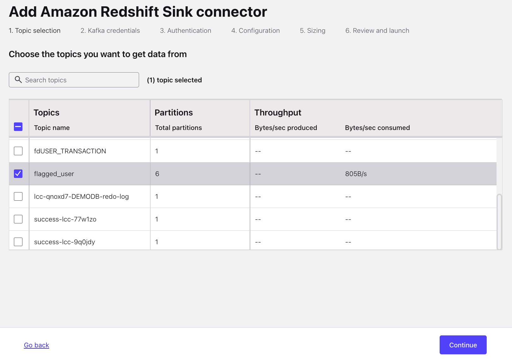

# Lab 1
In this lab, we will set up the Oracle XStream CDC Fully Managed Source Connector V1 and validate it by simulating transactions into a Web UI connected to the Oracle database.

---

## Table of Contents
1. [Set Up Oracle XStream CDC Fully Managed Source Premium Connector](#set-up-oracle-xstream-cdc-fully-managed-source-premium-connector)
2. [Create Both Real & Fraudulent Transactions with the Web UI](#create-both-real--fraudulent-transactions-with-the-web-ui)
3. [Set Up Redshift Fully Managed Sink Connector](#set-up-redshift-fully-managed-sink-connector)

---

## Set Up Oracle XStream CDC Fully Managed Source Premium Connector 

The following steps will result in database change events on the `DEMODB` database tables `USER_TRANSACTION` & `AUTH_USER` being streamed to Kafka topics `fd.USER_TRANSACTION` & `fd.AUTH_USER`

### Navigate to cluster connectors!

 
1. Log into [Confluent Cloud](https://confluent.cloud/login)
2. Select `Environments`
3. Select the environment named after the `confluent_environment_name` output from Terraform
4. Select the cluster named after the `confluent_cluster_name` output from Terraform
5. Select `Connectors` in the Cluster sidebar menu on the left

### Create Oracle XStream Fully Managed Connector

1. Type `oracle xstream CDC source premium` in the `search` text field
2. Select the `Oracle XStream CDC Source Premium` tile (it will be the only tile)
3. Generate Connector API Key
   1. Select the `My account` tile 
   2. Click the `Generate API key and download` button **Note:** If you too many existing API keys this will fail; remove any unused keys if this occurs 
   3. Click the `Continue` button **Note:** These API keys dont need to be recorded & will automatically be assigned to the cluster 
4. Fill in the relevant Oracle XStream Fields
   1. Enter `database_hostname` Terraform output into the `Database hostname` textbox
   2. Enter `database_port` Terraform output into the `Database port` textbox
   3. Enter `database_username` Terraform output into `Database username` textbox
   4. Enter `database_password` Terraform output into `Database password` textbox
   5. Enter `database_name` Terraform output into `Database name` textbox
   6. Enter `database_service_name` Terraform output into `Database service name` textbox
   7. Enter `pluggable_database_name` Terraform ouput into `Pluggable database (PDB) name` textbox
   8. Enter `xstream_outbound_server` Terraform ouput into `Xstream outbound server name` textbox
   9. Enter `1` into `Total number of Oracle processors to license` textbox
   10. Click the `Continue` button on the bottom right
5. Configure Connector settings 
   1. Select `JSON_SR` on the `Output Kafka record key format` select dropdown
   2. Select `JSON_SR` on the `Output Kafka record value format` select dropdown
   3. Enter `fd` into `Topic prefix` textbox
   4. Click on `Show advanced configurations` dropdown
   5. Select `DOUBLE` for `Decimal handling 
   mode`   
   6. Click the `Continue` button
6. Configure Connector sizing
   1. Enter **1** into the `Tasks max` textbox
   2. Click the `Continue` button
7. Configure Connector Name
   1. Enter any name you like in the `Connector name` textbox **Note:** This name will not be used anywhere else
   2. Click the `Continue` button
8. Wait for the connector to initialize; this could take ~5 minutes; The connector tile will show `Running` status when it is ready **Note:** You may need to refresh the page to update the connector status
9. The Connector has now successfully been setup and database change events on the `DEMODB` database tables `USER_TRANSACTION` & `AUTH_USER` will automatically be recorded to Kafka topic `fd.USER_TRANSACTION` & `fd.AUTH_USER`

---
## Create Both Real & Fraudulent Transactions with the Web UI
Now that all the Infrastructure is provisioned and the database connector is provisioned and setup we can start creating real database transactions.

### Connect to the Web UI 

 

1. Open the Web UI by opening your web browser to the URL found in the terraform output demo_details -> fraud_ui
2. In the UI turn on the `Stream Real Transactions` toggle; after it is toggled every ~5 seconds a valid transaction will be created and its details will be visible in the `All Transactions` table
3. Allow 5-6 valid transactions to be created
4. In the Web UI `Simulate Fraud` dropdown select each option and click the `Commit Fraud` button 4 times. Each option to select
   - `Burst Count Transaction`
   - `Burst Amount Transaction`
   - `Large Amount Transaction`
   - `Foreign Transaction`

### Validate Transactions are Streamed to Topic via Connector

1. Log into [Confluent Cloud](https://confluent.cloud/login)
2. Select `Environments`
3. Select the environment named after the `confluent_environment_name` output from Terraform
4. Select the cluster named after the `confluent_cluster_name` output from Terraform
5. Select `Topics` in the Cluster sidebar menu on the left
6. Examine the `Topic name` table column; the prefix.AUTH_USER & prefix.USER_TRANSACTION will exist. **Note:** your prefix may differ based on how you configured the `table prefix` in the connector settings in step 5 of setting up the Oracle XStream CDC connector.

---

## Set Up Redshift Fully Managed Sink Connector 
Lastly for this lab, we will send the topics to Redshift via the Redshift fully managed Sink Connector. Follow the same steps as setting up the Oracle XStream Source Connector but as a Sink. 

### Create Redshift Sink Managed Connector V1

1. Type `redshift sink` in the `search` text field
2. Select the `Redshift Sink` tile (it will be the only tile)
3. Select `flagged_user` checkbox in the Topics table 
4. Click the `Continue` button in the bottom right
5. Generate Connector API Key
   1. Select the `My account`tile 
   2. Click the `Generate API key and download` button **Note:** If you too many existing API keys this will fail; remove any unused keys if this occurs 
   3. Click the `Continue` button **Note:** These API keys dont need to be recorded & will automatically be assigned to the cluster
6. Configure Connector Authentication settings  
   1. Enter `redshift_endpoint` Terraform output into `Redshift Instance URL` textbox 
   2. Select `BASIC` on the `Endpoint Authentication Type` dropdown
   3. Enter `redshift_username` Terraform output into `Auth Username` textbox
   4. Enter `redshift_password` Terraform output into `Auth Password` textbox
   5. Select `false` on the `SSL_Enabled` dropdown
   6. Click the `Continue` button
7. Configure Connector Topic & Index settings
   1. Select `AVRO` option in the `Input Kafka record value format` horizontal selection
   2. Select `1` in `Number of indexes` select dropdown
   3. Enter `flagged_user` in only `index` textbox
   4. Enter `flagged_user` in only `topic` textbox **Note:** This should be the name of the table you [created with the flink detection sql query](#create-real-time-flink-processing-to-identify-fraudulent-events)
   5. Select `IGNORE` in the `Behavior for null valued records` dropdown
   6. Select `1` in the `Batch size` dropdown
   7. Click the `Continue` button
8. Click the `Continue` button on the next page
9. Click the `Continue` button on the next page
10. You will now be on the Connectors UI page seeing a tile that is provisioning the Redshift Connector
11. Wait for the Connector to initialize; it will take ~5 minutes and you may have to refresh the page

### View Topic Data in Redshift
Validate that the topics are successfully sent to Redshift.

---

To setup the Flink Compute Queries for Real-Time Stream Processing, follow the steps in [Lab 2](../LAB2/LAB2-README.md). 
