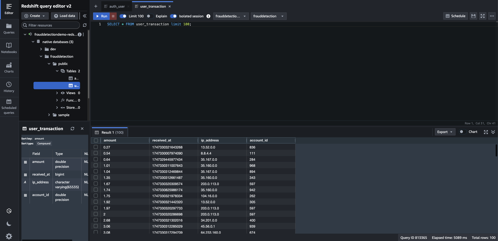

# Lab 1
In this lab, we will set up and validate the Oracle XStream CDC Fully Managed Source Connector by simulating transactions into a Web UI connected to the Oracle database.


---

## Table of Contents
1. [Set Up Oracle XStream CDC Fully Managed Source Premium Connector](#set-up-oracle-xstream-cdc-fully-managed-source-premium-connector)
2. [Create Both Real & Fraudulent Transactions with the Web UI](#create-both-real--fraudulent-transactions-with-the-web-ui)
3. [Set Up Redshift Fully Managed Sink Connector](#set-up-redshift-fully-managed-sink-connector)

---

## Set Up Oracle XStream CDC Fully Managed Source Premium Connector 

The following steps will result in database change events on the `DEMODB` database tables `USER_TRANSACTION` & `AUTH_USER` being streamed to Kafka topics `fd.USER_TRANSACTION` & `fd.AUTH_USER`

### Navigate to cluster connectors!

 
1. Log into [Confluent Cloud](https://confluent.cloud/login)
2. Select `Environments`
3. Select the environment named after the `confluent_environment_name` output from Terraform
4. Select the cluster named after the `confluent_cluster_name` output from Terraform
5. Select `Connectors` in the Cluster sidebar menu on the left

### Create Oracle XStream Fully Managed Connector


1. Type `oracle xstream CDC source premium` in the `search` text field
2. Select the `Oracle XStream CDC Source Premium` tile (it will be the only tile)
3. Generate Connector API Key
   1. Select the `My account` tile 
   2. Click the `Generate API key and download` button **Note:** If you too many existing API keys this will fail; remove any unused keys if this occurs 
   3. Click the `Continue` button **Note:** These API keys dont need to be recorded & will automatically be assigned to the cluster 
4. Fill in the relevant Oracle XStream Fields
   1. Enter `database_hostname` Terraform output into the `Database hostname` textbox
   2. Enter `database_port` Terraform output into the `Database port` textbox
   3. Enter `database_username` Terraform output into `Database username` textbox
   4. Enter `database_password` Terraform output into `Database password` textbox
   5. Enter `database_name` Terraform output into `Database name` textbox
   6. Enter `database_service_name` Terraform output into `Database service name` textbox
   7. Enter `pluggable_database_name` Terraform ouput into `Pluggable database (PDB) name` textbox
   8. Enter `xstream_outbound_server` Terraform ouput into `Xstream outbound server name` textbox
   9. Enter `1` into `Total number of Oracle processors to license` textbox
   10. Click the `Continue` button on the bottom right
5. Configure Connector settings 
   1. Select `AVRO` on the `Output Kafka record key format` select dropdown
   2. Select `AVRO` on the `Output Kafka record value format` select dropdown
   3. Enter `fd` into `Topic prefix` textbox
   4. Click on `Show advanced configurations` dropdown
   5. Select `DOUBLE` for `Decimal handling 
   mode`   
   6. Click the `Continue` button
6. Configure Connector sizing
   1. Enter **1** into the `Tasks max` textbox
   2. Click the `Continue` button
7. Configure Connector Name
   1. Enter any name you like in the `Connector name` textbox **Note:** This name will not be used anywhere else
   2. Click the `Continue` button
8. Wait for the connector to initialize; this could take ~5 minutes; The connector tile will show `Running` status when it is ready **Note:** You may need to refresh the page to update the connector status
9. The Connector has now successfully been setup and database change events on the `DEMODB` database tables `USER_TRANSACTION` & `AUTH_USER` will automatically be recorded to Kafka topic `fd.USER_TRANSACTION` & `fd.AUTH_USER`


---
## Create Both Real & Fraudulent Transactions with the Web UI
Now that all the Infrastructure is provisioned and the database connector is provisioned and setup we can start creating real database transactions.

### Connect to the Web UI 

 

1. Open the Web UI by opening your web browser to the URL found in the terraform output demo_details -> fraud_ui
2. In the UI turn on the `Stream Real Transactions` toggle; after it is toggled every ~5 seconds a valid transaction will be created and its details will be visible in the `All Transactions` table
3. Allow 5-6 valid transactions to be created
4. In the Web UI `Simulate Fraud` dropdown select each option and click the `Commit Fraud` button 4 times. Each option to select
   - `Burst Count Transaction`
   - `Burst Amount Transaction`
   - `Large Amount Transaction`
   - `Foreign Transaction`

### Validate Transactions are Streamed to Topic via Connector

These events from the Web UI are protected and only available within a private network; therefore, we will need to access the events from the internal windows jump server that we spun up in the prerequisite. 

1. Reopen the Windows Jump Server
2. From there, log into [Confluent Cloud](https://confluent.cloud/login)
3. Select `Environments`
4. Select the environment named after the `confluent_environment_name` output from Terraform
5. Select the cluster named after the `confluent_cluster_name` output from Terraform
6. Select `Topics` in the Cluster sidebar menu on the left
7. Examine the `Topic name` table column; the `prefix.AUTH_USER` & `prefix.USER_TRANSACTION` topics will exist. **Note:** your prefix may differ based on how you configured the `table prefix` in the connector settings in step 5 of setting up the Oracle XStream CDC connector.


---
## (OPTIONAL) Convert Topics to be Compatible With Redshift Connector

Now that we have verified the topics are successfully sent to our Kafka topics, we will now send the events to Redshift via the Redshift Fully Managed Sink Connector. However, the Redshift connector by default cannot process Kafka topics that have nested JSON data as seen in our `prefix.AUTH_USER` & `prefix.USER_TRANSACTION` topics. The Oracle XStream Connector creates the topics with `Before` and `After` State with some metadata into it. Therefore, we will need to create new filtered/clean topics leveraging Flink for these two topics before launching the Redshift Connector. 

### Navigate to Flink Via Internal Windows Machine
1. Staying in the Windows Jump Server in order to access private Flink
2. Select `Environments`
3. Select the environment named after the `confluent_environment_name` output from Terraform
4. In the horizontal menu select `Flink`
5. Select `Open SQL workspace`

### Convert Tables to be Compatible Using Flink

1. First, we will alter `prefix.AUTH_USER`.
   ```
   ALTER TABLE `fd.SAMPLE.AUTH_USER` SET ('changelog.mode' = 'append' , 'value.format' = 'avro-registry');
   ```
2. Create the first Flink table for `prefix.AUTH_USER` and click `Run`.  
   ```
   CREATE TABLE `auth_user` (
      `ID` DOUBLE,
      `PASSWORD` VARCHAR(2147483647),
      `LAST_LOGIN` BIGINT,
      `IS_SUPERUSER` DOUBLE,
      `USERNAME` VARCHAR(2147483647),
      `FIRST_NAME` VARCHAR(2147483647),
      `LAST_NAME` VARCHAR(2147483647),
      `EMAIL` VARCHAR(2147483647),
      `IS_STAFF` DOUBLE,
      `IS_ACTIVE` DOUBLE,
      `DATE_JOINED` BIGINT)
   DISTRIBUTED BY HASH(`ID`) INTO 1 BUCKETS
   WITH (
      'changelog.mode' = 'append',
      'connector' = 'confluent',
      'kafka.cleanup-policy' = 'delete',
      'kafka.max-message-size' = '8 mb',
      'kafka.retention.size' = '0 bytes',
      'kafka.retention.time' = '7 d',
      'key.format' = 'avro-registry',
      'scan.bounded.mode' = 'unbounded',
      'scan.startup.mode' = 'earliest-offset',
      'value.fields-include' = 'all',
      'value.format' = 'avro-registry'
   );
   ```
3. Create an `INSERT` query to insert into the new table `auth_user` and click `Run`. 
   ```
   INSERT INTO `auth_user`
   SELECT after.ID as ID,
      after.PASSWORD as PASSWORD,
      after.LAST_LOGIN as LAST_LOGIN,
      after.IS_SUPERUSER as IS_SUPERUSER,
      after.USERNAME as USERNAME,
      after.FIRST_NAME as FIRST_NAME,
      after.LAST_NAME as LAST_NAME,
      after.EMAIL as EMAIL,
      after.IS_STAFF as IS_STAFF,
      after.IS_ACTIVE as IS_ACTIVE,
      after.DATE_JOINED as DATE_JOINED
   FROM `fd.SAMPLE.AUTH_USER`;
   ```
4. To validate, run a `SELECT *` statement.
   ```
   SELECT * FROM `auth_user`;
   ``` 
5. Next we will alter `prefix.USER_TRANSACTION`.
   ```
   ALTER TABLE `fd.SAMPLE.USER_TRANSACTION` SET ('changelog.mode' = 'append' , 'value.format' = 'avro-registry');
   ```
6. Create the second table for `prefix.USER_TRANSACTION` and click `Run`.
    ```
   CREATE TABLE `user_transaction` (
      `ID` DOUBLE, 
      `AMOUNT` DOUBLE, 
      `RECEIVED_AT` BIGINT, 
      `IP_ADDRESS` VARCHAR(2147483647), 
      `ACCOUNT_ID` DOUBLE
      )
   DISTRIBUTED BY HASH(`ID`) INTO 1 BUCKETS
   WITH (
      'changelog.mode' = 'append',
      'connector' = 'confluent',
      'kafka.cleanup-policy' = 'delete',
      'kafka.max-message-size' = '8 mb',
      'kafka.retention.size' = '0 bytes',
      'kafka.retention.time' = '7 d',
      'key.format' = 'avro-registry',
      'scan.bounded.mode' = 'unbounded',
      'scan.startup.mode' = 'earliest-offset',
      'value.format' = 'avro-registry'
   );
   ```
5. Create an `INSERT` statement to insert into the new table `user_transaction` and click `Run`.
   ```
   INSERT INTO `user_transaction`
   SELECT after.ID as ID, 
      after.AMOUNT as AMOUNT, 
      after.RECEIVED_AT as RECEIVED_AT,
      after.IP_ADDRESS as IP_ADDRESS, 
      after.ACCOUNT_ID as ACCOUNT_ID 
   FROM `fd-.SAMPLE.USER_TRANSACTION`;
   ```
6. To verify, run a `SELECT *` statement.
   ```
   SELECT * FROM `user_transaction`;
   ``` 

Now that we have successfully cleaned out the data to be compatible with Redshift, we will navigate back to the `Connectors Hub`.

---
## Set Up Redshift Fully Managed Sink Connector 
Lastly for this lab, we will send the topics to Redshift via the Redshift fully managed Sink Connector. Follow the same steps as setting up the Oracle XStream Source Connector but as a Sink. 

### Create Redshift Sink Managed Connector

1. Type `redshift sink` in the `search` text field
2. Select the `Redshift Sink` tile (it will be the only tile)
3. Select `auth_user` and `user_transaction` checkboxes in the Topics table 
4. Click the `Continue` button in the bottom right
5. Generate Connector API Key
   1. Select the `My account`tile 
   2. Click the `Use an existing API key` button and paste in your API keys and secrets that you created earlier when creating the Oracle XStream CDC Source Connector. 
   3. Click the `Continue` button 
6. Configure Connector Authentication settings  
   1. Enter `redshift_endpoint` Terraform output into `AWS Redshift domain` 
   2. Enter `5439` into `AWS Redshift Port` 
   3. Enter `admin` into `Connection user` 
   4. Enter `Admin123456!` into `Connection password`
   5. Enter `frauddetection` into `Database name`
   6. Click the `Continue` button
7. Configure Connector Topic & Index settings
   1. Select `AVRO` option in the `Input Kafka record value format` horizontal selection
   2. Select `True` in `Auto create table` select dropdown
   3. Select `False` in `Enable Connector Auto-Restart`
   4. Enter `1` into `Batch size`
   5. Click the `Continue` button
8. Click the `Continue` button on the next page
9. You will now be on the Connectors UI page seeing a tile that is provisioning the Redshift Connector
10. Wait for the Connector to initialize; it will take ~5 minutes and you may have to refresh the page

### View Topic Data in Redshift
Let's validate in Redshift that the topics are successfully sent.

1. Navigate to Redshift in AWS
2. Click on the left hamburger icon, and select `Query editor v2`. This will launch you to the SQL editor. 
3. On the top right, select the cluster as `frauddetectiondemo-redshift-cluster-abcd123` and database as `frauddetection`.
4. Run a SELECT * statement for `auth_user`:
```
SELECT * FROM auth_user limit 100;
```
5. Click on the `+` on the top left to create a new editor and run another SELECT * statement for `user_transaction`:
```
SELECT * FROM user_transaction limit 100;
```


---
## Teardown

Let's manually tear down the 2 connectors that we have manually spun up: Oracle XStream CDC Connector and Redshift Sink Connector.

1. Navigate back to the Connectors Tab and Select Oracle XStream CDC Connector
2. Click on Settings Tab and Click on `Delete Connector` at the bottom of the page and confirm by typing in your connector's name.
3. Do the same for Redshift.

---

After Lab 1 is completed, follow the steps in [Lab 2](../LAB2/LAB2-README.md) to setup the Flink Compute Queries for Real-Time Stream Processing. 
