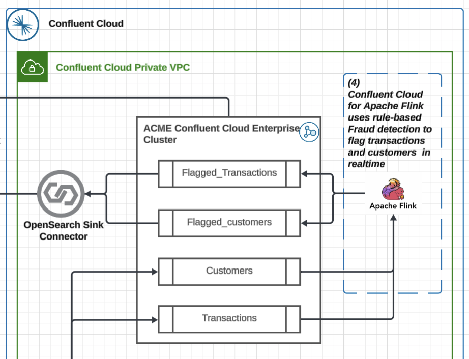
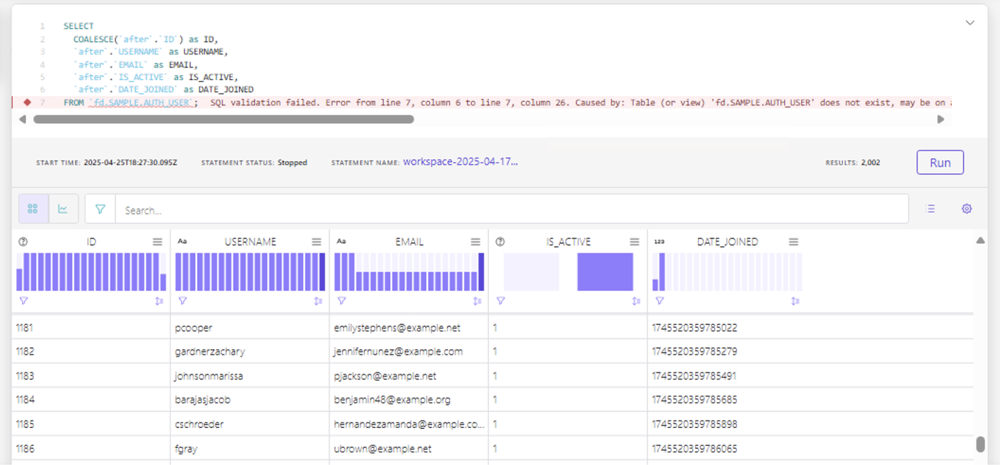
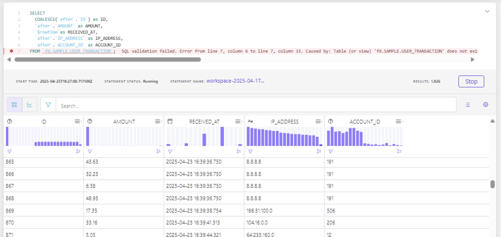
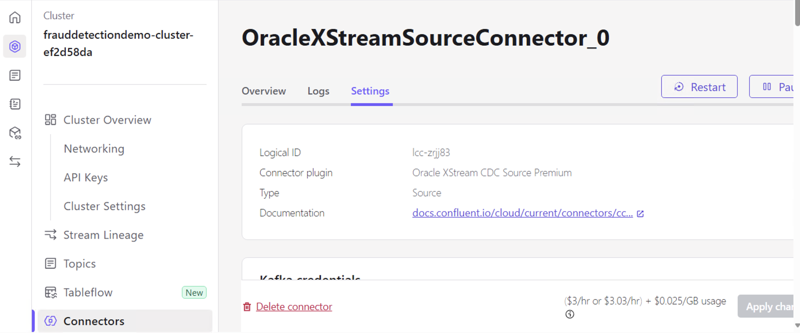

# Lab 2
In this lab, we will proceed to establish real-time stream processing of Kafka Topic events using Flink. Afterwards, we will send the newly enriched data into OpenSearch via the OpenSearch Fully Managed Sink Connector for further fraud detection analysis and dashboards.



---
## Table of Contents

1. [Write Flink Compute Queries for Real-Time Stream Processing](#write-flink-compute-queries-for-real-time-stream-processing)
2. [Set Up OpenSearch Sink Connector](#set-up-opensearch-sink-connector)
3. [Analyze Opensearch Dashboards](#analyze-opensearch-dashboards)
4. [Teardown](#teardown)
5. [Conclusion](#conclusion)
---

## Write Flink Compute Queries for Real-Time Stream Processing

### Navigate to Flink Via Internal Windows Machine</
These events are protected and only available within the private network; therefore, we will need to access the events from the internal windows jump server. 

1. Reopen the Windows Jump Server; this is the server setup in the [access the internal Windows machine section](#access-the-internal-windows-machine)
2. Log into [Confluent Cloud](https://confluent.cloud/login)
3. Select `Environments`
4. Select the environment named after the `confluent_environment_name` output from Terraform
5. In the horizontal menu select `Flink` 
6. Select `Open SQL workspace`

### Validate Flink has access to Oracle DB Connector Generated Events

1. In the Flink SQL Query Text Card enter **Note:** your prefix may differ based on how you configured the `table prefix` in the connector settings in step 5 of setting up the Oracle XStream CDC connector.
   ```
   SELECT  
    COALESCE(`after`.`ID`) as ID,
    `after`.`USERNAME` as USERNAME,
    `after`.`EMAIL` as EMAIL,
    `after`.`IS_ACTIVE` as IS_ACTIVE,
    `after`.`DATE_JOINED` as DATE_JOINED
   FROM `fd.SAMPLE.AUTH_USER`;
   ```
      
    >[NOTE]: Ignore the red `SQL Validation Failed`. This is due to trying to run Flink outside of a private cluster that we do not have access, but we are, in fact, running Flink in our private Windows Jump Server with the appropriate permissions.   
2. Click the `Run` button below the bottom right of the Flink SQL Query Text Card and results will populate.

3. Click the `+` icon to the left of the Flink SQL Query Text Card to create a new SQL Query Text Card.
4. In the new Flink SQL Query Text Card enter **Note:** your prefix may differ based on how you configured the `table prefix` in the connector settings in step 5 of [setting up the Oracle XStream CDC connector.
   ```
    SELECT 
      COALESCE(`after`.`ID`) as ID,
      `after`.`AMOUNT` as AMOUNT,
      `$rowtime`as RECEIVED_AT,
      `after`.`IP_ADDRESS` as IP_ADDRESS,
      `after`.`ACCOUNT_ID` as ACCOUNT_ID
    FROM `fd.SAMPLE.USER_TRANSACTION`;
   ```
   
   >[NOTE]: As the previous Flink job, ignore the red `SQL Validation Failed`.
5. Click the `Run` button below the bottom right of the Flink SQL Query Text Card and results will populate.

### Create Real-Time Flink Processing to Identify Fraudulent Events
1. Click `+` Icon to the left of the Flink SQL Query Text Card to create a new query card
2. In the new Flink SQL Query Text Card enter 

   **Note:** Record the name the table is set to (in this case it would be `flagged_user`); 
   **Note:** this query references the tables we validated in the previous steps, ensure you reference them correctly
   **Note:** If you do not do this step correctly data generated will force you rename the `flagged-user-materializer` to `flagged-user<attempt#>-materializer` & the flagged_user table (in `CREATE TABLE`) to `flagged_user<attempt#>`
   

   ```
   SET 'client.statement-name' = 'flagged-user-materializer';
    CREATE TABLE flagged_user (
      ACCOUNT_ID DOUBLE, 
      user_name STRING,
      email STRING,
      total_amount DOUBLE,
      transaction_count BIGINT,
      updated_at TIMESTAMP_LTZ(3),
      PRIMARY KEY (ACCOUNT_ID) NOT ENFORCED
    )
    AS 
    WITH transactions_per_customer_10m AS 
    (
      SELECT 
        `after`.`ACCOUNT_ID` AS ACCOUNT_ID,
        SUM(`after`.`AMOUNT`) OVER w AS total_amount,
        COUNT(*) OVER w AS transaction_count,
        `$rowtime` AS transaction_time
      FROM `fd.SAMPLE.USER_TRANSACTION`
      WINDOW w AS (
        PARTITION BY `after`.`ACCOUNT_ID`
        ORDER BY `$rowtime`
        RANGE BETWEEN INTERVAL '10' MINUTE PRECEDING AND CURRENT ROW
      )
    ) 
    SELECT 
      COALESCE(transactions.`ACCOUNT_ID`, 0) AS ACCOUNT_ID,
      u.`after`.`USERNAME` AS user_name,
      u.`after`.`EMAIL` AS email,
      transactions.`total_amount`,
      transactions.`transaction_count`,
      transactions.`transaction_time` AS updated_at
    FROM 
      transactions_per_customer_10m AS transactions
    JOIN `fd.SAMPLE.AUTH_USER` AS u 
      ON transactions.ACCOUNT_ID = u.`after`.`ID`
    WHERE 
      transactions.total_amount > 1000 OR transactions.transaction_count > 10;
   ```
3. Click the `Run` button below the bottom right of the Flink SQL Query Text Card and results will pop up

### Test the newly created fraud detection table

1. Click `+` Icon to the left of the Flink SQL Query Text Card to create a new query card
2. In the new Flink SQL Query Text Card enter 
   ```oracle
   SELECT * FROM `flagged_user`;
   ```
3. Click the `Run` button below the bottom right of the Flink SQL Query Text Card and results will pop up


**Note:** This will create a kafka topic named `flagged_user` which can be seen from the Kafka Cluster view as well.

### Generate more fraud events via UI to see real-time detection

1. [Open the fraud UI](#connect-to-the-web-ui) **Note:** if the port forwarding is still running in the terminal it won't need to be port forwarded again.
2. In the Web UI `Simulate Fraud` dropdown select the `Burst Count Transaction` option and click the `Commit Fraud` button 4 times. 
3. Navigate back to the `flagged_user` Flink SQL Query Card output setup in the [Test newly created fraud detection section](#test-the-newly-created-fraud-detection-table) & you will see fraud events generated (these can be validated via the `username` field)
---

## Set Up OpenSearch Sink Connector
We will now stream the real-time fraud Kafka events generated through the Flink query to a dashboard for the fraud team's analysis.

### Navigate to the Confluent Cluster Connector View</

1. Log into [Confluent Cloud](https://confluent.cloud/login)
2. Select `Environments`
3. Select the environment named after the `confluent_environment_name` output from Terraform
4. Select the cluster named after the `confluent_cluster_name` output from Terraform
5. Select `Connectors` in the Cluster sidebar menu on the left
6. Click `+ add connector` button in top right of the view

### Create OpenSearch Sink Managed Connector V1

1. Type `opensearch sink` in the `search` text field
2. Select the `OpenSearch Sink` tile (it will be the only tile)
3. Select `flagged_user` checkbox in the Topics table
4. Click the `Continue` button in the bottom right
5. Generate Connector API Key
   1. Select the `My account`tile 
   2. Click the `Generate API key and download` button **Note:** If you too many existing API keys this will fail; remove any unused keys if this occurs 
   3. Click the `Continue` button **Note:** These API keys dont need to be recorded & will automatically be assigned to the cluster
6. Configure Connector Authentication settings 
   1. Enter `opensearch_endpoint` Terraform output into `OpenSearch Instance URL` textbox 
   2. Select `BASIC` on the `Endpoint Authentication Type` dropdown
   3. Enter `opensearch_username` Terraform output into `Auth Username` textbox
   4. Enter `opensearch_password` Terraform output into `Auth Password` textbox
   5. Select `false` on the `SSL_Enabled` dropdown
   6. Click the `Continue` button
7. Configure Connector Topic & Index settings
   1. Select `ARVO` option in the `Input Kafka record value format` horizontal selection
   2. Select `1` in `Number of indexes` select dropdown
   3. Enter `flagged_user` in only `index` textbox
   4. Enter `flagged_user` in only `topic` textbox **Note:** This should be the name of the table you [created with the flink detection sql query](#create-real-time-flink-processing-to-identify-fraudulent-events)
   5. Select `IGNORE` in the `Behavior for null valued records` dropdown
   6. Select `1` in the `Batch size` dropdown
   7. Click the `Continue` button
8. Click the `Continue` button on the next page
9. Click the `Continue` button on the next page
10. You will now be on the Connectors UI page seeing a tile that is provisioning the OpenSearch Connector
11. Wait for the Connector to initialize; it will take ~5 minutes and you may have to refresh the page
---

## Analyze Opensearch Dashboards 

### Log into OpenSearch Dashboard

1. Go to URL from the Terraform output `opensearch_dashbaord_url`
2. Log into Opensearch using the Terraform outputs `opensearch_password` & `opensearch_username`
3. Click out of any modal pop-ups

### Create Dashboard for Flagged users

1. Select the side menu from the 3 horizontal lines icon in the top right
2. Select `Dashbaord Management` > `Dashboard Managment` **Note:** If this is not available in the menu create a empty dashboard and try again.
3. Click `Saved Objects` menu option on the vertical menu on the right
4. Select `Import` on the top right
5. Select `Import` and select the `fraud_dashboard.ndjson` [filepath](/dashboards/fraud_dashboard.ndjson) 
6. Wait for it to import 

### View the Dashboard for Flagged Users

1. Select the side menu from the 3 horizontal lines icon in the top right
2. Select `OpenSearch Dashboard` > `Dashboards`
3. Select `Fraud Dashboard` from the list view
4. You can see dashboards describing fraud events determined via flink in real-time

### Generate Real & Fraudulent transactions and view them in the fraud dashboard!


1. [Open the fraud UI](#connect-to-the-web-ui) **Note:** if the port forwarding is still running in the terminal it won't need to be port forwarded again.
2. In the UI turn on the `Stream Real Transactions` toggle; after it is toggled every ~5 seconds a valid transaction will be created and its details will be visible in the `All Transactions` table
3. Take note of the latest usernames from these transactions; they won't show up in the fraud dashboard
4. In the Web UI `Simulate Fraud` dropdown select the `Burst Count Transaction` option and click the `Commit Fraud` button 4 times. 
5. Take note of the 4 usernames correlated with these fraud events in the `All Transactions` table; they will be visible in the OpenSearch Fraud Dashboard
6. Navigate back to the Fraud Dashboard created in the [View the Dashboard for Flagged Users section](#view-the-dashboard-for-flagged-users); You will see the 4 usernames noted in step 5 of this section.
--- 

## Teardown

First, let's manually tear down the 3 connectors that we have manually spun up: Oracle XStream CDC Connector, Redshift Sink Connector, and OpenSearch Sink Connector

1. Navigate back to the Connectors Tab and Select Oracle XStream CDC Connector
2. Click on Settings Tab and Click on `Delete Connector` at the bottom of the page and confirm by typing in your connector's name.
3. Do the same for the other connectors.

Next, run the following command from the same directory as the `README.md` file to teardown the resources spun up from terraform.

   ```bash
   terraform -chdir=infra/Terraform destroy --auto-approve
   ```

---

## Conclusion
Congratulations! You have successfully deployed real-time fraud detection employing an Oracle DB on a private network, utilizing Confluent's Private Link, fully managed connectors, fully managed Kafka streams, and Opensearch dashboards.

This use case demonstrates the advanced and proactive approach financial institutions can adopt to combat fraud effectively. By integrating stream processing with private connectors, they can drive real-time monitoring and detection capabilities, ensuring secure and seamless transaction processing. 

Feel free to leverage and update this demo to work for your specific use case long term.
