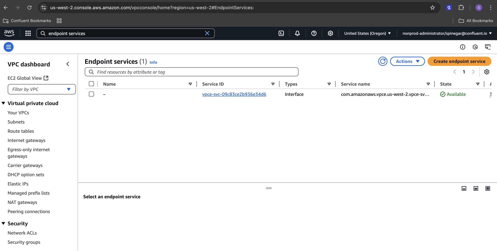
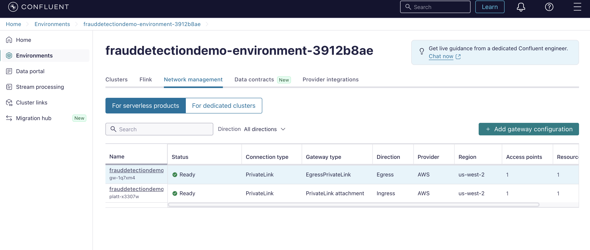
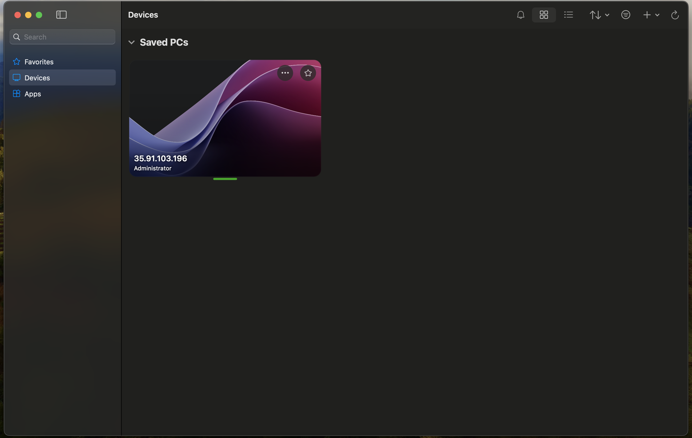

# Real Time Fraud Detection With Confluent Cloud
This demo will enable you to provision and test **real time** fraud detection using Private DB Connectors, Kafka event streams & real time Flink processing all easily orchestrated on Confluent Cloud. 

Fraud detection is crucial for protecting the financial assets of individuals and organizations in an increasingly digital world, leveraging analytical technologies to identify and prevent unethical activities and costly consequences. As digital transactions become more common, the complexity of fraud schemes also increases, requiring sophisticated detection methods. Modern methods like integrating advanced analytical and artificial intelligence algorithms help in identifying complex fraudulent patterns within vast datasets. 

This demo demonstrates how financial institutions can capture fraudulent transactions in real-time from databases that are on secure internal private networks by leveraging stream processing and private connectors.Through stream processing with Flink, transactions are joined, filtered, aggregated and analyzed in real time, while private connectors ensure that data flows securely between systems, offering a robust solution for modern fraud detection.

## Demo Diagram

The Demo was built to reflect a typical software production environment. It contains many common components such as:
- An EKS Kubernetes cluster hosts an app that can be accessed via the web
- An Oracle DB on a private internal network; No production database is publicly accessible

Real-Time fraud detection is achieved by adding a few more components:
- A Kafka Cluster to store, stream & manage transaction & fraud events
- An Oracle XStream Connector that streams database entries as Kafka events privately to a Kafka cluster hosted on Confluent Cloud
- A Flink Compute Pool for real-time fraud analysis based on transaction events deriving from Oracle XStream 
- OpenSearch Fully Managed Sink Connector to stream fraud events to a dashboard for the fraud team
- OpenSearch Instance to showcase dashboards for the fraud team's analysis and decision-making
---

## Table of Contents
1. [Prerequisites](#prerequisites)
2. [Provision Infrastructure with Terraform](#provision-infrastructure-with-terraform)
3. [Validate Networking Infrastructure](#validate-networking-infrastructure)
4. [Database Setup](#database-setup)
---

## Prerequisites


### Installing Homebrew

Homebrew is a package manager for macOS, necessary for installing Docker or other dependencies. Follow these steps to verify and install Homebrew:
1. Verify if Homebrew is installed by running:
   ```bash
   brew --version
   ```
   **Expected Output**:
   ```
   Homebrew X.X.X
   ```
2. If Homebrew is not installed, install it using the following command:
   ```bash
   /bin/bash -c "$(curl -fsSL https://raw.githubusercontent.com/Homebrew/install/HEAD/install.sh)"
   ```
3. Verify the installation:
   ```bash
   brew --version
   ```
   **Expected Output**:
   ```
   Homebrew X.X.X
   ```


### Install Supporting Software
In this section we will install and validate all required software for the demo with the following command

1. Run the command to install AWS CLI using Homebrew:
   ```bash
   brew install awscli
   brew tap hashicorp/tap
   brew install hashicorp/tap/terraform
   brew install confluentinc/tap/cli
   brew install kubectl
   ```


2. Verify the installation with the following command

   ```bash
   aws --version
   terraform -version
   confluent version
   kubectl version --client
   ```
   
   **Expected Output**:
   ```plaintext
   You should see version info for each program
   ```


### Windows Jump Server Software Installation

A Jump server on the internal network is required to connect to the Oracle DB that will be on a private internal network; the following software will allow you to connect to this jump server.

Download this application called `Windows App` for your specific OS.

### Create AWS Admin API Key

AWS Admin API keys are required to provision the necessary AWS infrastructure.

1. Create a new AWS IAM User
2. Grant the User Admin Permissions
3. Create API Key associated with the admin user (this should return a key & secret)
4. Copy the API key & secret into a usable place 
**Note:** Copy the region being used as well; Ex: `us-east-1`
5. Run `aws configure` and enter the appropriate API Key, Secret, & Region when prompted. 
**Note:** Region should be the same region User was created in

### Create Confluent Cloud API Keys
Confluent Cloud `Cloud resource management` API keys are required to provision the necessary Confluent Cloud infrastructure.

1. Log into Confluent
2. Open the sidebar menu and select `API keys`
3. Click `+ Add API key`
4. Associate API Key with `My account`
5. Select `Cloud resource management`
6. Create the API key and copy the Key & Secret into a usable place


---

## Provision Infrastructure with Terraform
Terraform is used to automatically provision and configure infrastructure for both AWS and CC. 

 >[!CAUTION]
 >If the pre-requisites are not completed correctly the following will fail!


### Set Terraform Variables
Terraform is configured via a[terraform.tfvars file](./infra/Terraform/terraform.tfvars).

All variables in the table below must be set in the [terraform.tfvars file](./infra/Terraform/terraform.tfvars) in order for Terraform to provision the infrastructure.

> [!NOTE]
> `example_var_key_name="example_var_key_value"`

| Key Name                   |  Type  | Description                           | Required |
|:---------------------------|:------:|:--------------------------------------|---------:|
| confluent_cloud_api_key    | string | [Key From CC](#create_cc_api_key)     |     True |
| confluent_cloud_api_secret | string | [Secret From CC](#create_cc_api_key)  |     True |


### Provision Infrastructure via Terraform

This step will provision all the necessary infrastructure.

Run the following command from the same directory as the `README.md` file.

   ```bash
   terraform -chdir=infra/Terraform init
   ```

> [!NOTE] **Note:** This step is API intensive and may take 20-30 minutes.

> [!NOTE] **Note:** If it fails initially rerun the apply; it will only take 5-7 minutes & will work the second time.
   
   ```bash
   terraform -chdir=infra/Terraform apply --auto-approve
   ```
   
   > [!NOTE] **Note:** Actual output will be different based on provisioned resources
   
  > [!NOTE]  **Note:** This output can be regenerated without in ~30 seconds after it has been generated once
   
   > [!NOTE] **Note:** Manually configured Resources will require inputs based on this output - exclude the quotes
   
  > [!NOTE] **Note** This output will occur the first time; rerun the apply and it will succeed
   ```text
   │ Error: error waiting for Access Point "abc123" to provision: access point "abc123" provisioning status is "FAILED": 
   │ 
   │   with confluent_access_point.confluent_oracle_db_access_point,
   │   on confluent_outbound_privatelink.tf line 15, in resource "confluent_access_point" "confluent_oracle_db_access_point":
   │   15: resource "confluent_access_point" "confluent_oracle_db_access_point" {
   │ 
   ╵
   ```
   
   **Expected Approximate Output:**
   ```text
   aws_caller_info = {
      "caller_arn" = "arn:aws:iam::123456:user/admin"
   }
   confluent_details = {
      "environment_name" = "frauddetectiondemo-environment-abcd123"
      "flink_pool_name" = "default"
      "kafka_cluster_name" = "frauddetectiondemo-cluster-abcd123"
   }
   demo_details = {
      "fraud_ui" =   "fraud_ui" =   "fraud_ui" = "http://k8s-frauddem-ingressf-abcd123-123456.region.elb.amazonaws.com/fraud-demo/"
   }
   opensearch_details = {
      "dashboard_url" = "https://search-frauddetectiondemo-abcd123-abcdefg1234567.region.es.amazonaws.com/_dashboards"
      "endpoint" = "https://search-frauddetectiondemo-abcd123-abcdefg1234567.region.es.amazonaws.com"
      "password" = "Admin123456!"
      "username" = "admin"
   }
   oracle_vm_db_details = {
      "connection_string" = "sqlplus system/Welcome1@10.0.10.90:1234/XEPDB1"
      "express_url" = "https://10.0.10.90:5500/em"
      "private_ip" = "10.0.10.90"
      "ssh" = "ssh -i ./sshkey-frauddetectiondemo-key-eabcd123-user@10.0.10.90"
   }
   oracle_xstream_connector = {
      "database_hostname" = "ip-10-0-10-90.region.compute.internal"
      "database_name" = "XE"
      "database_password" = "password"
      "database_port" = 1521
      "database_service_name" = "XE"
      "database_username" = "c##cfltuser"
      "decimal_handling_mode" = "double"
      "pluggable_database_name" = "XEPDB1"
      "table_inclusion_regex" = "SAMPLE[.](USER_TRANSACTION|AUTH_USER)"
      "topic_prefix" = "fd"
      "xstream_outbound_server" = "XOUT"
      }
      windows_jump_server_details = {
      "ip" = "12.345.678.90"
      "password" = "abcdefg12345"
      "username" = "Administrator"
   }

   ```

---

## Validate Networking Infrastructure
In the next step we will validate that the networking between AWS & Confluent is working as expected.

### Validate AWS Private Endpoint


1. Log into the AWS console
2. Enter `endpoint services` into the `search` textbox
3. Select the `endpoint services` feature button
4. You will see an entry in the list view; under the `State` column it should say active
5. You know the AWS Endpoint to view the Oracle DB state changes within the private network is correctly configured

### Validate Confluent Private Egress & Ingress


1. Reopen the Windows Jump Server; this is the server setup in the [access the internal Windows machine section](#access-the-internal-windows-machine)
2. Log into [Confluent Cloud](https://confluent.cloud/login)
3. Select `Environments`
4. Select the environment named after the `confluent_environment_name` output from Terraform
5. In the horizontal menu select `Network Managment` 
6. In the list view you will see 2 entries 
   1. Each entries `Status` column will say `Ready`
   2. One entries `Direction` column will say `Egress`, the others will say `Ingress`
7. You know the Confluent Ingress/Egress to interact with AWS has been provisioned correctly


---
## Database Setup

In order for the fully managed Oracle CDC Connector V1 to properly work with the Oracle DB provisioned via Terraform in AWS certain, Oracle DB settings must be configured.

The Oracle DB is configured on a private network within AWS, making it inaccessible from your local machine, and only accessibile from a machine within the private network.

This machine existing within the AWS private network has already been setup by Terraform and can be accessed using `Windows App` application that we downloaded in the [prerequisite software section](#4-windows-jump-server-software-installation).

### Access The Internal Windows Machine

1. Open the `Windows App`
2. Click the `+` Icon to add new Server Connection, Click `Add PC` from the dropdown menu
3. Enter `windows_instance_ip` value from Terraform outputs in the `PC name:` textbox
4. Click the `Credentials` dropdown menu, select `Add Credentials...`, A pop up menu will appear
5. Enter `windows_instance_username` value from Terraform outputs into the `Username:` text field
6. Enter `windows_instance_password` value from Terraform outputs into the `Password:` text field
7. Click the `Add` button in the bottom right of the credentials pop up 
8. Click the `Add` button in the bottom right of the instance pop up
9. Click the newly created pop up titled with the `windows_instance_ip`
10. You will be redirected to a Windows OS for the machine located the AWS Oracle DB network


**Note:** Minimize the window to the Internal Windows Machine it will be used later (you can always connect again if you already closed it)


---
To setup the Oracle DB CDC Fully Managed Connector V1, follow the steps in [Lab 1](./LAB1/LAB1-README.md). 

Skip to [Lab 2](./LAB2/LAB2-README.md) if Lab 1 is already completed. 

