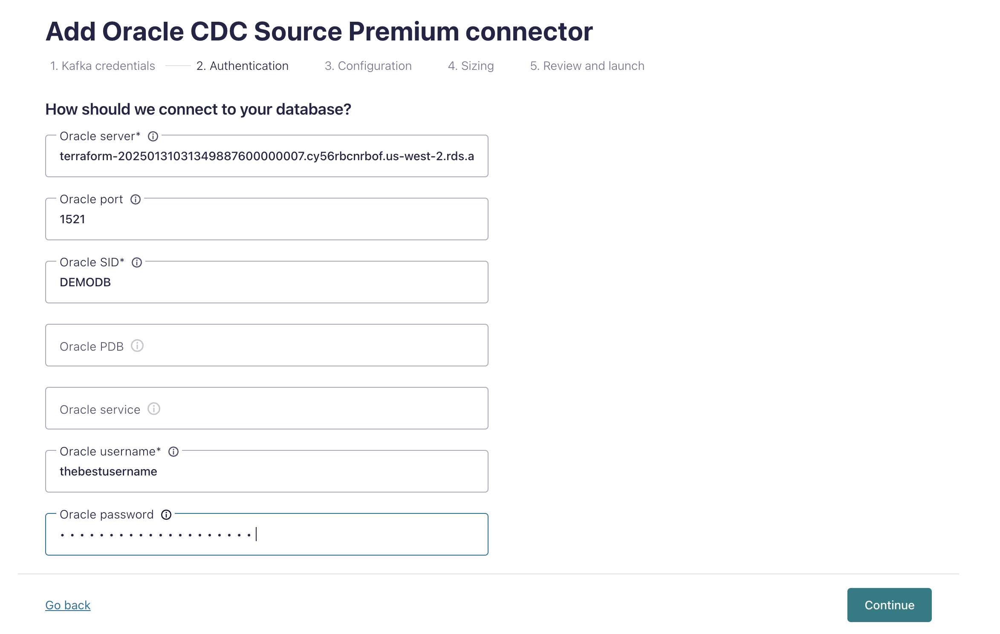

# Fully Managed Oracle CDC V1 Connector via Private Link Demo
This demo will cover key new Confluent features using a realistic application deployed on AWS.

## Demo Diagram

The Demo features real time fraud detection:
- Backend/Frontend that could be setup for any real world use case
- Oracle DB on a private internal network (almost every production DB is on a private network)
- Oracle DB CDC Fully Managed Connector that streams events based on Database interactions
- Confluent Kafka Cluster to store, stream & manage transaction & fraud events
- Confluent Flink Compute Pool for real time fraud detection based on transaction events spawned from the Oracle DB 
- OpenSearch Fully Managed Sink Connector to stream fraud events to a dashboard built for the fraud team
- OpenSearch Instance to display dashboards for the fraud team to analyze and make future decisions with
---

## Prerequisites 

### Software Prerequisites

#### 1. Install Homebrew
Homebrew is a package manager for macOS, which is necessary to install Docker or other dependencies. Follow these steps to check and install Homebrew:
1. Check if Homebrew is installed by running:
   ```bash
   brew --version
   ```
   **Expected Output**:
   ```
   Homebrew X.X.X
   ```
2. If Homebrew is not installed, install it using the following command:
   ```bash
   /bin/bash -c "$(curl -fsSL https://raw.githubusercontent.com/Homebrew/install/HEAD/install.sh)"
   ```
3. Verify the installation:
   ```bash
   brew --version
   ```
   **Expected Output**:
   ```
   Homebrew X.X.X
   ```
   
#### 2. Install All Other Software via HomeBrew
Install and validate all required software for the demo with the following command

1. Run the command to install AWS CLI using Homebrew:
   ```bash
   brew install awscli
   brew tap hashicorp/tap
   brew install hashicorp/tap/terraform
   brew install confluentinc/tap/cli
   brew install kubectl
   brew install jq
   ```

#### 3. Validate Software Installations
The Terraform Command Line Interface (CLI) is required to perform Terraform actions.

2. Verify the installation:
   ```bash
   aws --version
   terraform -version
   confluent version
   kubectl version --client
   jq --version
   ```
   **Expected Output**:
   ```plaintext
   You should see verion info for each program
   ```
   
#### 4. Windows Jump Server Software Installation
A Jump server on the internal network is required to connect to the Oracle DB that will be on a private internal network; the following software will allow you to connect to this jump server.

Download this application called `Windows App` for your specific OS.


### 2. API Key Prerequisites

#### 1. Configure AWS API KEY

In IAM create a User that has Admin Permissions 

1. Create a new AWS IAM User
2. Grant the User Admin Permissions
3. Create API Key associated with the admin user (this should return a key & secret)
4. Copy the API key & secret into a usable place **Note:** Copy the region being used as well; Ex: `us-east-1`
5. Run `aws configure` and enter the appropriate API Key, Secret, & Region when prompted. **Note:** Region should be the same region User was created in

#### 2. Configure Confluent Cloud API Key

In Confluent Cloud Create an API Key with  `Cloud resource management` Level Permissions

1. Log into Confluent
2. Open the sidebar menu and select `API keys`
3. Click `+ Add API key`
4. Associate API Key with `My account`
5. Select `Cloud resource management`
6. Create the API key and copy the Key & Secret into a usable place

---

## Terraform Setup
The following steps should be followed to setup Terraform which will automatically provision most of the critical infrastructure.
**Note:** If the pre-requisites are not completed correctly the following will fail

### 1. Configure Terraform Variables


In the [terraform.tfvars file](./infra/Terraform/terraform.tfvars) ensure the following variables are set:

Example: `example_var_key_name="example_var_key_value"`

- `confluent_cloud_api_key`: Key from Confluent
- `confluent_cloud_api_secret`: Secret from Confluent
- `aws_key`: Key from AWS
- `aws_secret`: Secret from AWS

### 2. Initialize Terraform Providers

This step ensures that you have access to the Cloud providers that Terraform will provision the infrastructure with

Run the following command from the same directory as the `README.md` file.

   ```bash
   terraform -chdir=infra/Terraform init
   ```

   **Expected Output:**
   ```text 
   Terraform has been successfully initialized!
   ```

### 3. Create the Infrastructure via Terraform

#### Infrastructure Provisioned Overview

The following steps provision, link, and coordinate the following resources on the following providers: **Note:** For more info on how resources interact please see the [Demo Diagram](#demo-diagram)

AWS:
 - AWS Managed Oracle DB
 - Private Network Infrastructure
 - Windows Machine 
 - Private Network Connection Point
 - OpenSearch Cluster
 - EKS Kubernetes Cluster
 - Kubernetes Deployment for Demo UI

Confluent:
 - Confluent Cloud Environment
 - Kafka Cluster
 - Flink Compute Pool
 - Private Schema Registry
 - Egress & Ingress Networking

#### Provisioning the Infrastructure
Run the following bash command from the directory containing the README.md file. This will start provision most of the demos required infrastructure.

**Note:** This step is API intensive and may take 20-30 minutes.

**Note:** If it fails initially rerun the apply; it will only take 5-7 minutes & will work the second time.

   ```bash
   terraform -chdir=infra/Terraform apply --auto-approve
   ```

   **Note:** Actual output will be different based on provisioned resources

   **Note:** This output can be regenerated without in ~30 seconds after it has been generated once

   **Note:** Manually configured Resources will require inputs based on this output - exclude the quotes

   **Note** This output will occur the first time; rerun the apply and it will succeed
   ```text
   │ Error: error waiting for Access Point "ap-4vw528" to provision: access point "ap-4vw528" provisioning status is "FAILED": 
   │ 
   │   with confluent_access_point.confluent_oracle_db_access_point,
   │   on confluent_outbound_privatelink.tf line 15, in resource "confluent_access_point" "confluent_oracle_db_access_point":
   │   15: resource "confluent_access_point" "confluent_oracle_db_access_point" {
   │ 
   ╵
   ```

   **Expected Approximate Output:**
   ```text
   confluent_environment_name = "frauddetectiondemo-environment-3912b8ae"
   opensearch_dashbaord_url = "https://search-frauddetectiondemo-3912b8ae-c4suntj5atq6d2bgeccuzok4dq.us-west-2.es.amazonaws.com/_dashboards"
   opensearch_endpoint = "https://search-frauddetectiondemo-3912b8ae-c4suntj5atq6d2bgeccuzok4dq.us-west-2.es.amazonaws.com"
   opensearch_password = "Admin123456!"
   opensearch_username = "admin"
   oracle_db_connection_string = "terraform-20250131031349887600000007.cy56rbcnrbof.us-west-2.rds.amazonaws.com:1521/DEMODB"
   oracle_db_dbname = "DEMODB"
   oracle_db_hostname = "terraform-20250131031349887600000007.cy56rbcnrbof.us-west-2.rds.amazonaws.com"
   oracle_db_password = "thebestpasswordever!"
   oracle_db_username = "thebestusername"
   resource-ids = <sensitive>
   windows_instance_ip = "54.214.225.66"
   windows_instance_password = "bLi%?aQ6JB=hG(Doz1h=AXtsl.6S0;6S"
   windows_instance_username = "Administrator"
   ```

---

## Validate Networking Infrastructure Provisioned
In the next step we will validate that the networking between AWS & Confluent is working as expected

### Validate AWS Private Endpoint 
1. Log into the AWS console
2. Enter `endpoint services` into the `search` textbox
3. Select the `endpoint services` feature button
4. You will see an entry in the list view; under the `State` column it should say active
5. You know the AWS Endpoint to view the Oracle DB state changes within the private network is correctly configured

### Validate Confluent Private Egress 
1. Reopen the Windows Jump Server; this is the server setup in the [access the internal Windows machine section](#access-the-internal-windows-machine)
2. Log into [Confluent Cloud](https://confluent.cloud/login)
3. Select `Environments`
4. Select the environment named after the `confluent_environment_name` output from Terraform
5. In the horizontal menu select `Network Managment` 
6. In the list view you will see 2 entries 
   1. Each entries `Status` column will say `Ready`
   2. One entries `Direction` column will say `Egress`, the others will say `Ingress`
7. You know the Confluent Ingress/Egress to interact with AWS has been provisioned correctly

---

## Database Setup

In order for the fully managed Oracle CDC Connector V1 to work with the Oracle DB provisioned via Terraform in AWS certain Oracle DB settings must be configured.

The Oracle DB is set up on a private network within AWS therefore it cannot be accessed and configured from your local machine and must be accessed from a machine within the private network.

This machine existing within the AWS private network has already been setup by Terraform and can be accessed using `Windows App` application that we downloaded in the [prerequisite software section](#4-windows-jump-server-software-installation).

### Access The Internal Windows Machine

1. Open the `Windows App`
2. Click the `+` Icon to add new Server Connection, Click `Add PC` from the dropdown menu
3. Enter `windows_instance_ip` value from Terraform outputs in the `PC name:` textbox
4. Click the `Credentials` dropdown menu, select `Add Credentials...`, A pop up menu will appear
5. Enter `windows_instance_username` value from Terraform outputs into the `Username:` text field
6. Enter `windows_instance_password` value from Terraform outputs into the `Password:` text field
7. Click the `Add` button in the bottom right of the credentials pop up 
8. Click the `Add` button in the bottom right of the instance pop up
9. Click the newly created pop up titled with the `windows_instance_ip`
10. You will be redirected to a Windows OS for the machine located the AWS Oracle DB network

### Download Oracle DB client software on Internal Windows Machine

1. Open the web browser on the machine
2. Download your Database Tool of Choice (I prefer Pycharm) **Note:** Pycharm will automatically download Oracle JDK
3. Download Oracle JDK 
4. Open your DB tool
5. Connect to the DB 

### Configure Oracle DB with client
1. Run the following command to configure the Database

   ```oracdle
   begin
    rdsadmin.rdsadmin_util.alter_supplemental_logging(
        p_action => 'ADD',
        p_type   => 'ALL');
   end;
   ```
2. Validate the database is configured
   ```oracle
   SELECT log_mode FROM v$database;
   ```
   
   **Expected Output:**
   ```text
   LOG_MODE
   -------
   ARCHIVELOG
   ```
3. The database has now been configured.

**Note:** Minimize the window to the Internal Windows Machine it will be used later (you can always connect again if you already closed it)

---

## Setup Oracle DB CDC Fully Managed Connector V1

The following steps will result in database change events on the `DEMODB` database tables `USER_TRANSACTION` & `AUTH_USER` being streamed to Kafka topics `fd.USER_TRANSACTION` & `fd.AUTH_USER`

### Navigate to cluster connectors
1. Log into [Confluent Cloud](https://confluent.cloud/login)
2. Select `Environments`
3. Select the environment named after the `confluent_environment_name` output from Terraform
4. Select the cluster named after the `confluent_cluster_name` output from Terraform
5. Select `Connectors` in the Cluster sidebar menu on the left

### Create Oracle DB CDC Fully Managed Connector V1
1. Type `oracle cdc source premium` in the `search` text field
2. Select the `Oracle CDC Source Premium` tile (it will be the only tile)
3. Generate Connector API Key
   1. Select the `My account`tile 
   2. Click the `Generate API key and download` button **Note:** If you too many existing API keys this will fail; remove any unused keys if this occurs 
   3. Click the `Continue` button **Note:** These API keys dont need to be recorded & will automatically be assigned to the cluster 
 
4. Fill in the relevant Oracle DB Fields
   1. Enter `oracle_db_hostname` Terraform output into the `Oracle server`textbox
   2. Enter `oracle_db_port` Terraform output into the `Oracle port` textbox
   3. Enter `oracle_db_dbname` Terraform output into the `Oracle SID` textbox
   4. Leave `Oracle PDB`textbox empty
   5. Leave `Oracle Service` textbox empty
   6. Enter `oracle_db_username` Terraform output into `Oracle username` textbox
   7. Enter `oracle_db_password` Terraform output into `Oracle password` textbox
   8. Click the `Contineu` button on the bottom right
5. Configure Connector settings 
   1. Enter `oracle_connector_table_inclusion_regex` Terraform output into `Table inclusion regex` textbox 
   2. Enter **fd.${tableName}** into `Topic name tempalte` textbox **Note:** the prefix **fd** can be changed but will be referenced later; you can use any character only prefix here
   3. Select `JSON_SR` on the `Output Kafka record key format` select dropdown
   4. Select `JSON_SR` on the `Output Kafka record value format` select dropdown
   5. Click the `Show advanced settings` dropdown arrow
   6. Select `best_fit_or_string` on the `Map NUMERIC values by precision and scale` select dropdown
   7. Click the `Continue` button
6. Configure Connector sizing
   1. Enter **2** into the `Tasks max` textbox
   2. Click the `Continue` button
7. Configure Connector Name
   1. Enter any name you like in the `Connector name` textbox **Note:** This name will not be used anywhere else
   2. Click the `Continue` button
8. Wait for the connector to initialize; this could take ~5 minutes; The connector tile will show `Running` status when it is ready **Note:** You may need to refresh the page to update the connector status
9. The Connector has now successfully been setup and database change events on the `DEMODB` database tables `USER_TRANSACTION` & `AUTH_USER` will automatically be recorded to Kafka topic `fd.USER_TRANSACTION` & `fd.AUTH_USER`

---

## Update Kubernetes Cluster Access
We need to allow our local computer to access the Kubernetes cluster via the AWS terminal

### Navigate to the Cluster Access Panel
1. Log into your AWS Console
2. Navigate to the correct Region
3. Navigate to the EKS Cluster Page
4. Select the appropriate Cluster
5. Select `Access` on the horizontal cluster menu
6. Select the `Manage Access` button

### Update Access Type to allow AWS IAM
1. Select `EKS API and ConfigMap` option and then select `Save changes`; this will take ~5 minutes to update

### Create IAM Access Entry
1. Navigate back to the `Access` panel on the horizontal cluster menu; The `IAM access entries` card will activate the `Create access entry` button when the above setting is updated, click the `Create access entry` (you may need to refresh the page)
2. In the `IAM Principal` dropdown select the [Admin user the AWS API key being used is configured with](#1-configure-aws-api-key)
3. In the `Type` dropdown select `Standard`
4. Click the `Next` button
5. In the `PolicyName` dropdown select `AmazonEKSAdminPolicy`
6. In the `Access Scope` select the `Cluster` radio button
7. Click the `Next` button
8. On the next page click the `Create` button

### Add Access Policies to Created IAM Access Entry
1. Navigate back to the `Access` panel on the horizontal cluster menu
2. Click on the IAM Access Entry created in the [Create IAM Access Entry step](#create-iam-access-entry)
3. Scroll down to the `Access policies` card
4. Select `Add access policy` on the `Access policies` card
5. In the `PolicyName` dropdown select `AmazonEKSAdminPolicy`
6. In the `Access Scope` select the `Cluster` radio button
7. Click the `Add access policy` button
8. Repeat these steps for the `AmazonEKSClusterAdminPolicy`

---

## Setup Web Application & Simulate Transactions
Now that all the Infrastructure is provisioned and the database connector is provisioned and setup we can start creating real database transactions.

### Validate Kubernetes Cluster Setup Terraform
1. Ensure that only one Kubernetes Cluster is being created
   ```bash
   export AWS_REGION="us-west-2" # set the correct AWS Region 
   aws eks list-clusters --region ${AWS_REGION} #
   ```
   **Expected Output:**
   
   Example of a successful output:
   ```text
   {
       "clusters": [
           "frauddetectiondemo-eks-cluster-<cluster-string-name>",
      ]
   }
   ```
   
   **Note:** You will need to press `ctrl c` after this is ran

2. Store the kubernetes cluster name so you can interact with it.
   ```bash
   export AWS_CLUSTER_NAME=$(aws eks list-clusters --region ${AWS_REGION} --output json | jq -r '.clusters[0]')
   echo $AWS_CLUSTER_NAME
   ```
   
   **Expected Output:**
   
   ```text
   frauddetectiondemo-eks-cluster-<cluster-string-name>
   ```
   
3. Update your local Kube config to enable `kubectl` command line client 
   ```bash
   aws eks --region ${AWS_REGION} update-kubeconfig --name ${AWS_CLUSTER_NAME}
   ```

   **Expected Output:**

   ```text
   Added new context arn:aws:eks:<region-name>:<account-id>:cluster/<cluster-name> to kubeconfig
   ```

4. Validate you can access the Pod
   ```bash
   kubectl get nodes
   ```
   
   **Expected Output:**
   ```text
   NAME STATUS ROLES AGE VERSION ip-192-168-1-1.ec2.internal Ready  15m v1.25.6 ip-192-168-2-1.ec2.internal Ready  15m v1.25.6
   ```
5. Set working namespace to default
   ```bash
   kubectl config set-context --current --namespace=default
   ```
   **Expected Output:**
   ```text
   Context "<current-context>" modified.
   ```
6. Validate namespace is set to default
   ```bash
   kubectl config view --minify | grep namespace:
   ```
   
   **Expected Output:**
   ```text
   namespace: default
   ```
7. Validate the web application is running
   ```bash
   export POD_LOGS=$(kubectl get pods --sort-by=.metadata.creationTimestamp \
     -o jsonpath='{.items[?(@.metadata.name contains "fraud-demo")].metadata.name}' | awk 'NR==1')
   echo $POD_LOGS
   kubectl get pods
   kubectl logs ${POD_LOGS}
   ```
   
   **Expected Output**
   ```text
   10.0.11.94 - - [03/Feb/2025:19:03:03 +0000] "GET /health/ HTTP/1.1" 200 16 "-" "kube-probe/1.31+"
   ```

### Connect to the Web UI
To connect to the Web UI and create transactions we will need to port forward the pod connection to our localhost

1. Port forward from Kubernetes Pod to LocalHost
   ```bash
   export POD_PORT_FORWARD=$(kubectl get pods --sort-by=.metadata.creationTimestamp \
    -o jsonpath='{.items[?(@.metadata.name contains "fraud-demo")].metadata.name}' | awk 'NR==1')
   echo $POD_PORT_FORWARD
   kubectl port-forward pod/${POD_PORT_FORWARD} 8000:8000
   ```

   **Expected Outputs:**
   ```text
   Forwarding from [::1]:8000 -> 8000
   ```
2. Open the Web UI by opening your webbrowser to [http://localhost:8000/fraud-demo/](http://localhost:8000/fraud-demo/)
3. In the UI turn on the `Stream Real Transactions` toggle; after it is toggled every ~5 seconds a valid transaction will be created and its details will be visible in the `All Transactions` table
4. Allow 5-6 valid transactions to be created
5. In the Web UI `Simulate Fraud` dropdown select each option and click the `Commit Fraud` button 4 times. Each option to select
   - `Burst Count Transaction`
   - `Burst Amount Transaction`
   - `Large Amount Transaction`
   - `Foreign Transaction`

   
### Validate Topic Setup Success
To validate the Connector topic streams were set up correctly the following steps can be taken.

1. Log into [Confluent Cloud](https://confluent.cloud/login)
2. Select `Environments`
3. Select the environment named after the `confluent_environment_name` output from Terraform
4. Select the cluster named after the `confluent_cluster_name` output from Terraform
5. Select `Topics` in the Cluster sidebar menu on the left
6. Examine the `Topic name` table column; the prefix.AUTH_USER & prefix.USER_TRANSACTION will exist. **Note:** your prefix may differ based on how you configured the `table prefix` in the connector settings in step 5 of [setting up the Oracle DB CDC connector](#setup-oracle-db-cdc-fully-managed-connector-v1).
---

## Setup Flink Compute Queries
We will now setup realtime Kafka Topic event processing via flink. These events are protected and only accessible in the private network; this mean we will need to access the events from the internal windows jump server.

### Navigate to Flink Via Internal Windows Machine
1. Reopen the Windows Jump Server; this is the server setup in the [access the internal Windows machine section](#access-the-internal-windows-machine)
2. Log into [Confluent Cloud](https://confluent.cloud/login)
3. Select `Environments`
4. Select the environment named after the `confluent_environment_name` output from Terraform
5. In the horizontal menu select `Flink` 
6. Select `Open SQL workspace`

### Validate Flink has access to Oracle DB Connector Generated Events
1. In the Flink SQL Query Text Card enter **Note:** your prefix may differ based on how you configured the `table prefix` in the connector settings in step 5 of [setting up the Oracle DB CDC connector](#setup-oracle-db-cdc-fully-managed-connector-v1).
   ```oracle
   SELECT * FROM `prefix.AUTH_USER`;
   ```
2. Click the `Run` button below the bottom right of the Flink SQL Query Text Card and results will populate.
3. Click the `+` icon to the left of the Flink SQL Query Text Card to create a new SQL Query Text Card.
4. In the new Flink SQL Query Text Card enter **Note:** your prefix may differ based on how you configured the `table prefix` in the connector settings in step 5 of [setting up the Oracle DB CDC connector](#setup-oracle-db-cdc-fully-managed-connector-v1).
   ```oracle
    SELECT * FROM `prefix.USER_TRANSACTION`;
   ```
   
5. Click the `Run` button below the bottom right of the Flink SQL Query Text Card and results will populate.
### Update the User Transaction table watermark to allow Timestamp based operations
1. Click `+` Icon to the left of the Flink SQL Query Text Card to create a new query card
2. In the new Flink SQL Query Text Card enter **Note:** the environment and cluster name will change based on the terraform output vars; the prefix will change as well based on what you determined it to be.
   ```oracle
   ALTER TABLE `terraform_output_confluent_environment_name`.`terraform_output_confluent_cluster_name`.`prefix.USER_TRANSACTION` 
       MODIFY WATERMARK FOR `RECEIVED_AT` AS `RECEIVED_AT`;
   ```
3. Click the `Run` button below the bottom right of the Flink SQL Query Text Card and results will pop up

   
### Create Real Time Flink Processing to Identify Fraudulent Events
1. Click `+` Icon to the left of the Flink SQL Query Text Card to create a new query card
2. In the new Flink SQL Query Text Card enter 

   **Note:** Record the name the table is set to (in this case it would be `flagged_user`); 
   **Note:** this query references the tables we validated in the previous steps, ensure you reference them correctly
   **Note:** If you do not do this step correctly data generated will force you rename the `flagged-user-materializer` to `flagged-user<attempt#>-materializer` & the flagged_user table (in `CREATE TABLE`) to `flagged_user<attempt#>`
   

   ```oracle
   SET 'client.statement-name' = 'flagged-user-materializer';
   CREATE TABLE flagged_user (
     ACCOUNT_ID BIGINT, 
     user_name STRING,
     email STRING,
     total_amount DOUBLE,
     transaction_count BIGINT,
     updated_at TIMESTAMP_LTZ(3),
     PRIMARY KEY (ACCOUNT_ID) NOT ENFORCED
   )
   AS 
   WITH transactions_per_customer_10m AS 
   (
     SELECT 
       ACCOUNT_ID,
       SUM(AMOUNT) OVER w AS total_amount,
       COUNT(*) OVER w AS transaction_count,
       RECEIVED_AT AS transaction_time
     FROM `test.USER_TRANSACTION`
     WINDOW w AS (
       PARTITION BY ACCOUNT_ID
       ORDER BY RECEIVED_AT
       RANGE BETWEEN INTERVAL '10' MINUTE PRECEDING AND CURRENT ROW
     )
   ) 
   SELECT 
     COALESCE(ACCOUNT_ID, 0) AS ACCOUNT_ID,
     u.USERNAME AS user_name,
     u.EMAIL AS email,
     transanactions.total_amount,
     transanactions.transaction_count,
     transanactions.transaction_time AS updated_at
   FROM 
     transactions_per_customer_10m AS transanactions
   JOIN `test.AUTH_USER` AS u 
     ON transanactions.ACCOUNT_ID = u.`key`
   WHERE 
     transanactions.total_amount > 1000 OR transanactions.transaction_count > 10;
   ```
3. Click the `Run` button below the bottom right of the Flink SQL Query Text Card and results will pop up

### Test the newly created fraud detection table
1. Click `+` Icon to the left of the Flink SQL Query Text Card to create a new query card
2. In the new Flink SQL Query Text Card enter 
   ```oracle
   SELECT * FROM `flagged_user`;
   ```
3. Click the `Run` button below the bottom right of the Flink SQL Query Text Card and results will pop up


**Note:** This will create a kafka topic named `flagged_user` which can be seen from the Kafka Cluster view as well.

### Generate more fraud events via UI to see Real Time detection
1. [Open the fraud UI](#connect-to-the-web-ui) **Note:** if the port forwarding is still running in the terminal it won't need to be port forwarded again.
2. In the Web UI `Simulate Fraud` dropdown select the `Burst Count Transaction` option and click the `Commit Fraud` button 4 times. 
3. Navigate back to the `flagged_user` Flink SQL Query Card output setup in the [Test newly created fraud detection section](#test-the-newly-created-fraud-detection-table) & you will see fraud events generated (these can be validated via the `username` field)

---

## Setup OpenSearch Sink Connector
We will now stream the real time fraud kafka events being generated via the Flink query to a dashbaord for the fraud team to analyze

### Navigate to the Confluent Cluster Connector View
1. Log into [Confluent Cloud](https://confluent.cloud/login)
2. Select `Environments`
3. Select the environment named after the `confluent_environment_name` output from Terraform
4. Select the cluster named after the `confluent_cluster_name` output from Terraform
5. Select `Connectors` in the Cluster sidebar menu on the left
6. Click `+ add connector` button in top right of the view

### Create OpenSearch Sink Managed Connector V1
1. Type `opensearch sink` in the `search` text field
2. Select the `OpenSearch Sink` tile (it will be the only tile)
3. Select `flagged_user` checkbox in the Topics table
4. Click the `Continue` button in the bottom right
5. Generate Connector API Key
   1. Select the `My account`tile 
   2. Click the `Generate API key and download` button **Note:** If you too many existing API keys this will fail; remove any unused keys if this occurs 
   3. Click the `Continue` button **Note:** These API keys dont need to be recorded & will automatically be assigned to the cluster
6. Configure Connector Authentication settings 
   1. Enter `opensearch_endpoint` Terraform output into `OpenSearch Instance URL` textbox 
   2. Select `BASIC` on the `Endpoint Authentication Type` dropdown
   3. Enter `opensearch_username` Terraform output into `Auth Username` textbox
   4. Enter `opensearch_password` Terraform output into `Auth Password` textbox
   5. Select `false` on the `SSL_Enabled` dropdown
   6. Click the `Continue` button
7. Configure Connector Topic & Index settings
   1. Select `ARVO` option in the `Input Kafka record value format` horizontal selection
   2. Select `1` in `Number of indexes` select dropdown
   3. Enter `flagged_user` in only `index` textbox
   4. Enter `flagged_user` in only `topic` textbox **Note:** This should be the name of the table you [created with the flink detection sql query](#create-real-time-flink-processing-to-identify-fraudulent-events)
   5. Select `IGNORE` in the `Behavior for null valued records` dropdown
   6. Select `1` in the `Batch size` dropdown
   7. Click the `Continue` button
8. Click the `Continue` button on the next page
9. Click the `Continue` button on the next page
10. You will now be on the Connectors UI page seeing a tile that is provisioning the OpenSearch Connector
11. Wait for the Connector to initialize; it will take ~5 minutes and you may have to refresh the page

---

## Setup Opensearch Dashboard 

### Log into OpenSearch Dashboard
1. Go to URL from the Terraform output `opensearch_dashbaord_url`
2. Log into Opensearch using the Terraform outputs `opensearch_password` & `opensearch_username`
3. Click out of any modal pop-ups

### Create Dashboard for Flagged users
1. Select the side menu from the 3 horizontal lines icon in the top right
2. Select `Dashbaord Management` > `Dashboard Managment` **Note:** If this is not available in the menu create a empty dashboard and try again.
3. Click `Saved Objects` menu option on the vertical menu on the right
4. Select `Import` on the top right
5. Select `Import` and select the `fraud_dashboard.ndjson` [filepath](/dashboards/fraud_dashboard.ndjson) 
6. Wait for it to import 

### View the Dashboard for Flagged Users
1. Select the side menu from the 3 horizontal lines icon in the top right
2. Select `OpenSearch Dashboard` > `Dashboards`
3. Select `Fraud Dashboard` from the list view
4. You can see dashboards describing fraud events determined via flink in real time

### Generate Real & Fraudulent transactions and view them in the fraud dashboard
1. [Open the fraud UI](#connect-to-the-web-ui) **Note:** if the port forwarding is still running in the terminal it won't need to be port forwarded again.
2. In the UI turn on the `Stream Real Transactions` toggle; after it is toggled every ~5 seconds a valid transaction will be created and its details will be visible in the `All Transactions` table
3. Take note of the latest usernames from these transactions; they won't show up in the fraud dashboard
4. In the Web UI `Simulate Fraud` dropdown select the `Burst Count Transaction` option and click the `Commit Fraud` button 4 times. 
5. Take note of the 4 usernames correlated with these fraud events in the `All Transactions` table; they will be visible in the OpenSearch Fraud Dashboard
6. Navigate back to the Fraud Dashboard created in the [View the Dashboard for Flagged Users section](#view-the-dashboard-for-flagged-users); You will see the 4 usernames noted in step 5 of this section.


## Conclusion
Congratulations! You have successfully implemented real time fraud detection using an Oracle DB on a private network, Confluents Private Link,  Fully managed connectors, fully managed Kafka streams, and Opensearch dashboards.

This demo can be updated to work for your specific use case long term.
