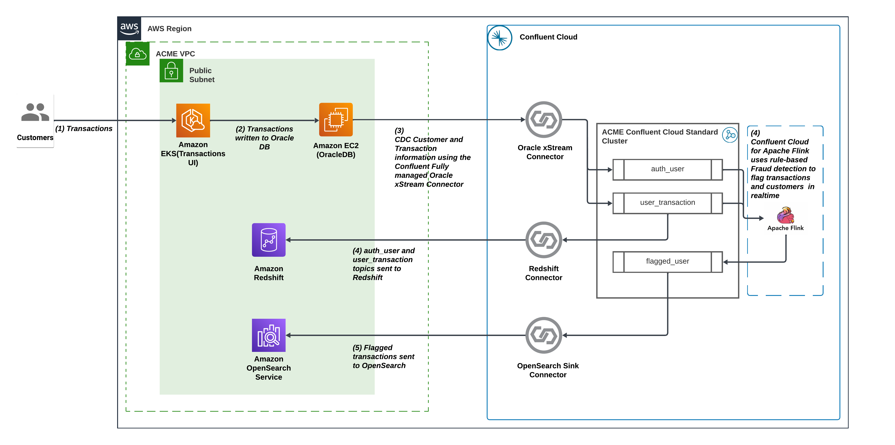

# Real Time Fraud Detection With Confluent Cloud
This demo will enable you to provision and test **real time** fraud detection using Connectors, Kafka event streams & real time Flink processing all easily orchestrated on Confluent Cloud. 

Fraud detection is crucial for protecting the financial assets of individuals and organizations in an increasingly digital world, leveraging analytical technologies to identify and prevent unethical activities and costly consequences. As digital transactions become more common, the complexity of fraud schemes also increases, requiring sophisticated detection methods. Modern methods like integrating advanced analytical and artificial intelligence algorithms help in identifying complex fraudulent patterns within vast datasets. 

This demo demonstrates how financial institutions can capture fraudulent transactions in real-time from databases by leveraging stream processing and connectors. Through stream processing with Flink, transactions are joined, filtered, aggregated and analyzed in real time, offering a robust solution for modern fraud detection.

## Demo Diagram

The Demo was built to reflect a typical software production environment. It contains many common components such as:
- An EKS Kubernetes cluster hosts an app that can be accessed via the web
- An Oracle DB

Real-Time fraud detection is achieved by adding a few more components:
- A Kafka Cluster to store, stream & manage transaction & fraud events
- An Oracle XStream Connector to stream database entries as Kafka events.
- A Flink Compute Pool to enrich transaction events from Oracle and morph them into data products for real-time fraud analysis 
- A Redshift Instance and Redshift Fully Managed Sink Connector to stream authentication and user transaction events for storage
- An OpenSearch Instance and OpenSearch Fully Managed Sink Connector to stream fraud events into dashboards for analysis and decision-making
---

## Table of Contents
1. [Prerequisites](#prerequisites)
2. [Provision Infrastructure with Terraform](#provision-infrastructure-with-terraform)
3. [Labs](#labs)
4. [Clean-Up](#clean-up)
---

## Prerequisites

### Install Supporting Software
In this section we will install and validate all required software for the demo with the following command

1. Follow the steps below to install required software:
   - **macOS** users will install everything from a terminal using Homebrew:
      ```bash
      brew install awscli
      brew tap hashicorp/tap
      brew install hashicorp/tap/terraform
      brew install confluentinc/tap/cli
      brew install kubectl
      ```

   - **Windows** users will follow the installation instructions below:
      - [AWS CLI](https://docs.aws.amazon.com/cli/latest/userguide/getting-started-install.html)
      - [Terraform](https://developer.hashicorp.com/terraform/install#windows)
      - [Confluent CLI](https://docs.confluent.io/confluent-cli/current/install.html)
      - [kubectl](https://kubernetes.io/docs/tasks/tools/install-kubectl-windows/)


2. Verify the installation with the following command

   ```bash
   aws --version
   terraform -version
   confluent version
   kubectl version --client
   ```

### Create AWS API Key

AWS API keys will be provisioned and provided to users on the day of the workshop. 

### Create Confluent Cloud API Keys

Confluent Cloud `Cloud resource management` API keys are required to provision the necessary Confluent Cloud infrastructure.
</summary><details>

1. Log into Confluent Cloud
2. Open the sidebar menu and select `API keys`
3. Click `+ Add API key`
4. Associate API Key with `My account`
5. Select `Cloud resource management`
6. Create the API key and copy the Key & Secret into a usable place
</details>   

## Clone the Repo
```
git clone https://github.com/confluentinc/demo-dsp-fraud-detection.git
```

## Provision Infrastructure with Terraform
Terraform is used to automatically provision and configure infrastructure for both AWS and CC. 

 >[!CAUTION]
 >If the pre-requisites are not completed correctly the following will fail!


### Set Terraform Variables
Terraform is configured via a terraform.tfvars file that users will create manually. Keep the terraform.tfvars in `infra/Terraform` directory.

``` 
nano terraform.tfvars 
```

All variables in the table below must be set in the terraform.tfvars file in order for Terraform to provision the infrastructure.

| Key Name                   |  Type  | Description                           | Required     |
|:---------------------------|:------:|:--------------------------------------|-------------:|
| confluent_cloud_api_key    | string | [Key From CC](#create_cc_api_key)     |         True |
| confluent_cloud_api_secret | string | [Secret From CC](#create_cc_api_key)  |         True |


### Provision Infrastructure via Terraform

This step will provision all the necessary infrastructure, which may take up to 40 minutes.

Run the following commands from the same directory as the `README.md` file in order to initialize and apply Terraform.

   ```bash
   terraform -chdir=infra/Terraform init
   ```
   
   ```bash
   terraform -chdir=infra/Terraform apply --auto-approve
   ```


---

## Labs

There are two labs to demonstrate two different use cases with Confluent Cloud. 
1. [Lab 1](./LAB1/LAB1-README.md) shows the path to migration from legacy systems like Oracle to modern data warehouses like Redshift by leveraging Confluent Cloud fully managed connectors. User authentication and transaction events will be streamed from a Fraud Detection website. 
2. [Lab 2](./LAB2/LAB2-README.md) showcases developing stream processing applications like filters, aggregations and joins in real-time with Flink and sending the newly enriched fraud data into OpenSearch dashboards or other analytics applications. 

---
## Clean-up
Once you are finished with this demo, remember to destroy the resources you created, to avoid incurring charges. You can always spin it up again anytime you want.

Before tearing down the infrastructure, delete the Oracle XStream, Redshift and OpenSearch connectors, as they were created outside of Terraform and won't be automatically removed:

```
confluent connect cluster delete <CONNECTOR_ID> --cluster <CLUSTER_ID> --environment <ENVIRONMENT_ID> --force
```

To destroy all the resources created run the command below from the ```terraform``` directory:

```
terraform -chdir=infra/Terraform destroy --auto-approve
```

